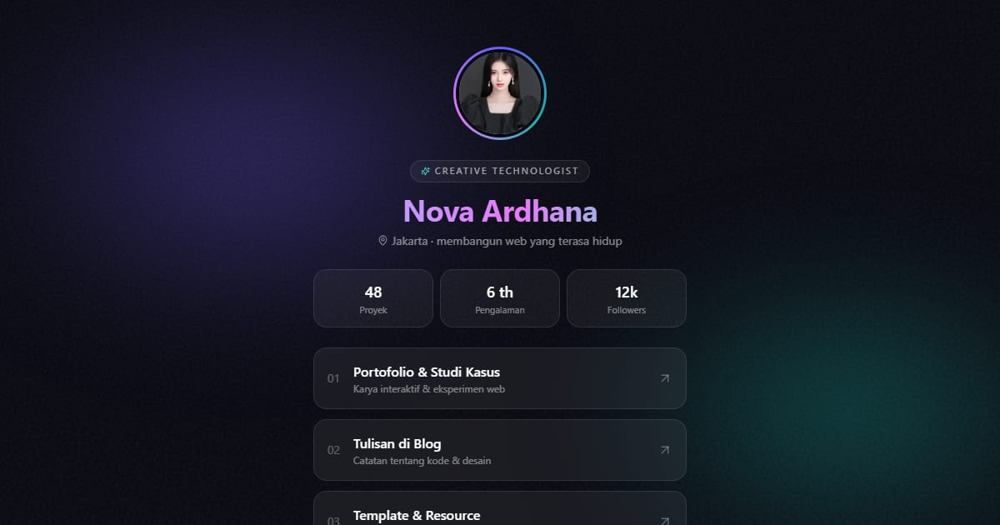

# Nova Ardhana — Creative Technologist

Tautan Nova Ardhana, creative technologist di Jakarta: empat studi kasus web interaktif, lab eksperimen, tarif, dan slot kolaborasi.

**Demo live:** https://linkinbio-nova.vercel.app



> Template link-in-bio dengan persona fiktif. Akun, klien, harga, dan jadwal hanya contoh; tautan utama menuju halaman dalam yang benar-benar ada, dan formulir tidak mengirim data.

## Konsep

Persona Nova Ardhana, creative technologist. Aurora gelap dengan kaca buram, avatar bercincin, baris tautan bernomor, dan trio statistik.

## Halaman

- `/` — tautan bernomor ke halaman dalam, avatar monogram bercincin conic, trio statistik
- `/karya` — studi kasus (masalah, pendekatan, hasil) dan lab eksperimen
- `/kolaborasi` — layanan & tarif mulai, slot kosong, cara kerja, formulir

## Teknologi

- Next.js 15.5 (App Router) dan React 19
- Tailwind CSS v4
- JavaScript
- Lucide (ikon)
- Font: Sora, Inter (next/font)
- SEO: metadata per halaman, Open Graph, JSON-LD, sitemap.xml, dan robots.txt

## Menjalankan secara lokal

```bash
npm install
npm run dev
```

Buka http://localhost:3000. Untuk build produksi: `npm run build` lalu `npm start`.

---

Bagian dari koleksi 12 template link-in-bio di [PortalBio](https://portal-bio-neon.vercel.app). Dibuat oleh [PintuWeb](https://pintuweb.com), jasa pembuatan website.
